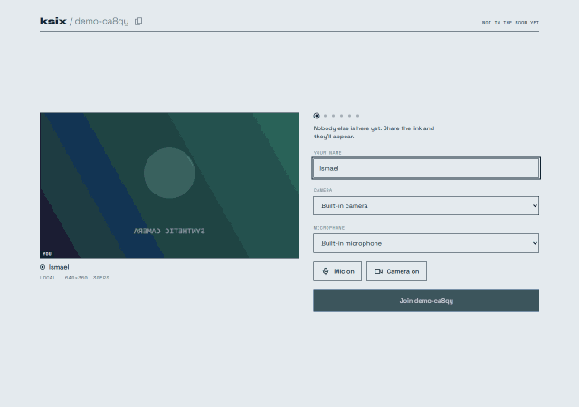

# ksix

Video calls for up to six people. Open a link, land in a green room, join. Built this to write the WebRTC by hand instead of calling someone's SDK, so there's no media server, no accounts, no database. Rooms live in memory and die with the process.

[](https://github.com/IsmaelAlGh03/ksix/actions/workflows/ci.yml)



## What it does

Video and chat go straight between browsers. The server introduces two peers and then gets out of the way. It never sees a frame or a message.

- Up to six people in a room, everyone connected to everyone
- Green room first: name, camera and mic pickers, preview, live headcount
- Text chat and image sharing over the DataChannel
- Export the transcript as one self-contained HTML file
- Screen sharing, camera stays live beside it
- Per-link readouts: direct or relayed, RTT, packet loss, bitrate
- A links view that draws the mesh and marks the bad edges
- ICE restart when a link drops, then relay, then a tile that says it failed

## How the mesh works

Socket.io only carries the introduction: the offer, the answer, ICE candidates. Perfect negotiation decides who is polite by comparing socket ids, so two people joining at the same moment don't deadlock on glare. After that, media and chat flow directly and the server sees none of it.

```
Peer A                  Server (Socket.io)                  Peer B
   │ ── offer ─────────────────►│                              │
   │                            │ ── offer ───────────────────►│
   │◄──────────────── answer ───│◄───────────── answer ────────│
   │ ◄── ICE candidates ───────►│◄── ICE candidates ──────────►│
   │                            │                              │
   │══════ media + chat, direct, the server sees none ════════►│
```

Six people means fifteen links, and your browser encodes for every one of them. That's the ceiling on a mesh, and why the room stops at six. Not a plan tier.

## Under the hood

A few things I cared about beyond "it works":

- **A dead link says it's dead.** Chrome stops firing `connectionstatechange` once a connection hits `failed`, so an event-driven recovery loop waits forever. The ladder runs on timers instead: two ICE restarts, a relay if TURN is configured, then a failed tile rather than a frozen frame that still looks live.
- **Validate on receive, not just on send.** The image allowlist only ran on the send path, but an incoming attachment's mime type is written by the peer. Announce `text/html` and the lightbox opens that blob URL — script in the app's own origin. The reassembler now checks first.
- **Figures for links you're not in belong to someone else.** You can't measure a connection between two other people, so the number arrives over the DataChannel. Both ends report it, so the reading comes from the lower socket id. Pick arbitrarily and it flips every poll.
- **Tested in layers.** Room membership is pure logic, tested without a socket in sight. No faked `RTCPeerConnection` anywhere, on purpose: a fake only proves the fake works. Anything that needs a real one goes through Playwright.

## Stack

**Frontend:** React 18, TypeScript, Vite, Tailwind 4, WebRTC, Socket.IO client

**Backend:** Node/Express 5, Socket.IO for signaling only, no database

**Tests:** Vitest both sides, Playwright for end-to-end

**Live:** [ksix.dev](https://ksix.dev). Client on Vercel, signaling server on Render.

The server sleeps after 15 minutes idle. The first join then waits about a minute while it wakes, and the green room says so while you wait.

## Running it locally

You need Node 24.

```bash
git clone https://github.com/IsmaelAlGh03/ksix.git
cd ksix
npm run install:all
npm run dev
```

Server on `localhost:4000`, client on `localhost:5173`. Open the client in two tabs to call yourself. Nothing to configure. The defaults live in the code, so there are no files to copy first.

Both sides read environment variables when you want to change one. `server/.env.example` and `client/.env.example` list them. `METERED_APP_NAME` and `METERED_API_KEY` are the ones worth knowing about. Set them and the server fetches short-lived relay credentials and hands them to the browser over `GET /ice`. Leave them and it's STUN-only, which is fine on most networks and fails on locked-down ones. The secret stays on the server; nothing about the relay is ever built into the client bundle.

## Tests

```bash
npm test          # 67 server + 294 client, Vitest
npm run test:e2e  # 10 specs, Playwright
```
